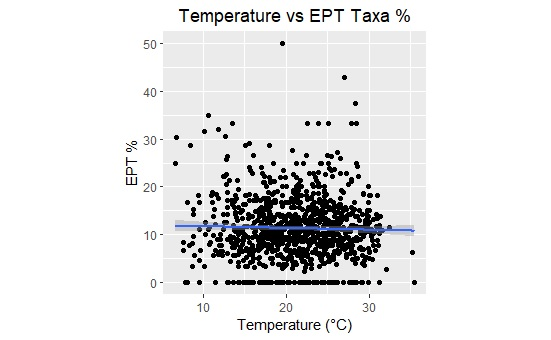
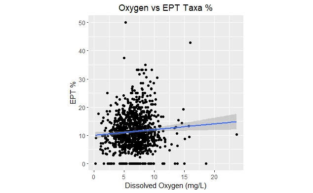
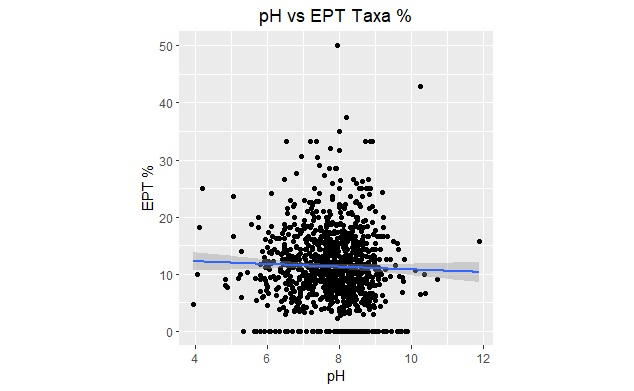
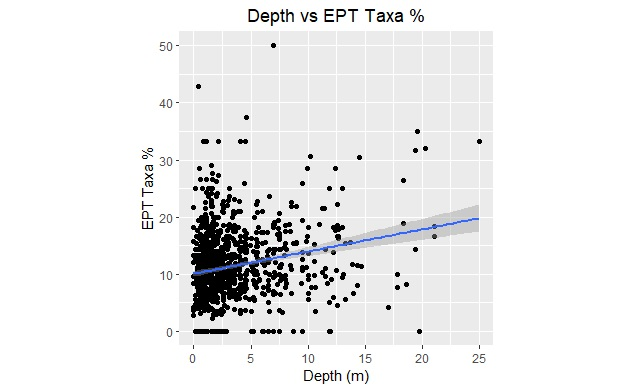
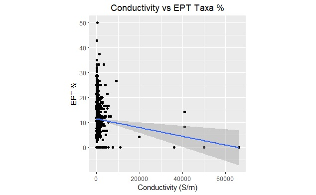

```{r setup, include=FALSE}
knitr::opts_chunk$set(echo = TRUE)

```


##Abstract
This study aimed to examine possible physical and chemical effects on lake health using the common biological indicators: Ephemeroptera, Plecoptera and Trichoptera (EPT). As many studies look at anthropogenic sources and pollutants affecting water health, we aimed to determine how percent EPT differs based on lake physicochemical variables. The data used in this study derives from the US Environmental Protection Agency's 2012 National Lakes Assessment. Physical and chemical variables used include temperature, pH, conductivity, and dissolved oxygen content and benthic macroinvertebrate data used included percent EPT. Linear scatter plots with regression lines were created to investigate correlations between the variables at interest. After no significant correlations, model selection was performed using a saturated model including the variables as fixed effects and interactions with temperature as well. Next, models with delta less than or equal to two were selected as the top models and model averaging was performed to limit uncertainties within the top models. Using AIC values and model averaging, the results indicated that no interactions between temperature and the other variables had any significant effect on EPT percentage. Only depth and temperature reported significant effects on percent EPT. This study suggests there are differences in percent EPT based on lake physicochemical variables, indicating the physical parameters of the lake may affect percent EPT. Lake physicochemical must be taken into consideration, along with current chemical state for water quality assessments and conservation. The findings of this study and future studies can be implemented into conservation efforts to ensure the maintenance and longevity of aquatic ecosystems.
 
##Introduction
A strong indicator of water quality is the diversity of benthic macroinvertebrate. Benthic macroinvertebrates are invertebrate taxa living on the ground of aquatic ecosystems, such as insect larvae, crustaceans, molluscs, and aquatic worms. The use of these taxa as indicators to assess water quality of lakes, streams and rivers is becoming a common method of biological monitoring (Freshwater Biomonitoring and Benthic Macroinvertebrates). The macroinvertebrate species with the most restricted tolerances towards water quality degradation are Ephemeroptera, Plecoptera, and Trichoptera, broadly termed EPT (Lenat, 1993).  

  Past research found that physical and chemical properties of aquatic ecosystems can indicate various EPT biodiversity metrics independently (Cairns & Pratt, 1993; Schartau, Moe, Sandin, McFarland, & Raddum, 2008; Slooff, 1983). The sensitivity of EPT to both physical as well as chemical parameters result in its robust characteristic as a biological indicator. The difficulty here lies in dissecting the differences between physicochemical variables and pollutants on EPT biodiversity. That is, the EPT biodiversity metric cannot be used alone as an indicator of anthropogenic impact, as it constantly reflects its intolerance to physical and chemical variables. This study hypothesizes physicochemical variables will significant affect percent EPT.  
  
  Our study was motivated by the National Lakes Assessment (NLA), an assessment conducted in 2012 to evaluate the conditions of lakes in the USA (U.S. Environmental Protection Agency, 2016). The NLA used physical, chemical and biological indicators to assess the condition of lakes but did not fully examine the effect of physical and chemical water qualities on the biological indicators.  
  
  Our aims were twofold: first, we examined the effects of physical and chemical parameters on EPT in lakes; then, we examined the effects of temperature on the relationship between EPT and abiotic factors. Using this dataset, we first investigated the effect of five abiotic factors on EPT: depth, pH, conductivity, temperature and dissolved oxygen. We determined that it was most important to study the interactive effects of temperature on other parameters, as benthic macroinvertebrates have been found to be sensitive to thermal regimes, and small changes will likely affect the EPT diversity0020(Durance & Ormerod, 2007; Gore, 1977; Munn & Brusven, 1991). From this study, we can gain a greater understanding of how different water qualities in lakes affect benthic macroinvertebrates.
 
##Methods
###Data description
The data for this comes from the U.S Environmental Protection Agency 2012 National Lakes Assessment (EPA, 2016).  The EPA collected data from 1,038 lakes in the United States in the year 2012. Field crews collected water quality and benthic invertebrate data from lakes. For detailed field data collection techniques, refer to the technical report (US Environmental Protection Agency (U.S. EPA), 2017). The data from the 2012 National Lakes Assessment report (U.S. Environmental Protection Agency, 2016) includes measures of algal toxins, atrazine, benthic macroinvertebrates, chlorophyll-a, physical habitat, landscape data, phytoplankton, water chemistry, Secchi depth, sediment, site information, water isotope variables and zooplankton. For this study, we selected the 'Benthic Macroinvertebrate Metrics' and 'Water Chemistry' data sets. The 'Benthic Macroinvertebrate Metrics' dataset includes data on the number and percentage of various taxa found within the samples. The 'Water Chemistry' data set includes data on various site specific physical and chemical variables. After collecting the data, we performed all analysis using R 3.5.1 and R Studio 1.1.383.  

###Data analysis
First, we examined both data sets and filtered out the variables to be used in the analysis. From the 'Benthic Macroinvertebrate Metrics' data set, we selected columns using the select function in R package tidyverse to select SITE_ID (a unique site identifier) and EPT_PTAX (the percent of the taxa in the sample which were EPT). Next, we filtered out all NA's out of the EPT_PTAX column in the benthic macroinvertebrate dataset. If no SITE_ID was recorded, we replaced the empty cells with NA's using the mutate function and then filtered NA's from the site column as well.  
  
  Within the 'Water Chemistry' data set, we selected SITE_ID, State, CONDUCTIVITY, DEPTH, OXYGEN, PH, and TEMPERATURE using the select function in the package tidyverse. There were several water chemistry samples for each site, so we averaged the water chemistry samples by site using the mutate and summarize function in the package tidyverse. Several SITE_ID's were missing, so we filled the empty cells with NA's using the mutate function in tidyverse, then filtered all NA's out of the SITE_ID column. We also filtered out NA's from the CONDUCTIVITY, DEPTH, OXYGEN, PH, and TEMPERATURE columns. Next, we merged the selected and filtered water chemistry and benthic macroinvertebrate data sets using the right_join function and grouped by Site_ID. Following this, we explored the data and noticed outliers within the temperature data; therefore, we replaced all temperatures greater than 50 degrees Celsius with NA and filtered NA's out of the temperature column.  
  
  After the data sets were organized and cleaned, we began to analyze the data using the package ggplot. EPT_PTAX was plotted as the response variable against each water chemistry variable. A linear model regression line was plotted over the resulting plots to investigate correlations in the data. As no clear correlation emerged from any of the plots independently, we performed model selection using the package MuMIN. We created a saturated model with the variables as fixed effects and interactions of temperature with depth, oxygen and conductivity as depth, oxygen and conductivity showed significant differences based on EPT_PTAX. This was done to investigate if temperature interactions change relationships between EPT and the other variables. Next, we dredged the model using AIC as the rank through the function dredge. Then, we subset the models produced from model dredging to models with a delta less than or equal to two. After subsetting, only four models remained, and these models were averaged to arrive at the final model. This is done as any model with a delta less than or equal to 2 is not significantly different, thus averaging contributes to avoiding uncertainty in the models. All R code used for this project is attached at the end of this paper.  
 
##Results
 
 



 



	






Variable
Estimate
Std. Error
t value
Pr(>|t|)
Adjusted R-squared
Depth
5.29E-01
6.54E-02
8.078
1.832-15
0.04627
Conductivity
-1.52E-04
5.30E-05
-2.87
0.004183
0.009016
Temperature
1.60E-01
4.43E-02
3.605
0.000328
4.06E-05
Oxygen
2.69E-01
8.44E-02
3.184
0.001495
0.00495
pH
-1.64E-01
2.18E-01
-0.75
0.453202
0.2616


Table 1: Table depicting results from first general linear model, including all chemical and physical variables of interest. Bolded were the variables that were found to be most significant. Adjusted R-squared for each variable was calculated separately in R in a general linear model with EPT_PTAX as the dependent variable. Statistical significance at P < 0.05 is indicated by bold text.


Model
df
logLik
AIC
delta
weight
Adjusted R-squared
Model with No Interactions
6
-3351.59
6715.19
0
0.39
0.07298
Model with Conductivity and Temperature Interactions
7
3351.02
6716.03
0.85
0.25
0.07313
Model with Oxygen and Temperature Interactions
7
-3351.35
6716.7
1.51
0.18
7.24E-02
Model with Depth and Temperature Interactions
7
-3351.37
6716.73
1.55
0.18
0.07257

Table 2: Four top models extracted from the dredged saturated model created with interactions between temperature and the three other significant variables. In bold is the most significant model with the lowest AIC value. 

    


Estimate
<dbl>
Std. Error
<dbl>
Adjusted SE
<dbl>
z value
<dbl>
Pr(>|z|)
<dbl>


(Intercept)
4.384069e+00
1.623845e+00
1.625513e+00
2.6970371
0.0069959
Conductivity
-9.703185e-05
1.623372e-04
1.624494e-04
0.5973052
0.5503036
Depth
5.135467e-01
1.042203e-01
1.043229e-01
4.9226652
0.0000009
Oxygen
2.885777e-01
1.741035e-01
1.742630e-01
1.6559901
0.0977238
Temperature
1.705990e-01
6.867057e-02
6.873744e-02
2.4818939
0.0130686
Conductivity:Temperature
-3.163551e-06
7.996480e-06
8.001552e-06
0.3953671
0.6925720
Oxygen:Temperature
-1.832567e-03
7.299212e-03
7.305366e-03
0.2508522
0.8019284
Depth:Temperature
1.300781e-03
5.361594e-03
5.366199e-03
0.2424026
0.8084682
Table 3: Model averaged coefficients, the full averaged table extracted. The terms bolded were the significant variables indicated in R. Statistical significance at P < 0.05 is indicated by bold text.  
  
  As the first step in our study, Figures 1-5 depict our exploratory data analysis, where we attempted to identify any correlation between EPT percentage with the chemical and physical variables of interest; oxygen, pH, temperature, conductivity and depth. There was weak correlation in each of the graphs as depicted by the linear regression line, but slight trends were found between depth, dissolved oxygen and conductivity.  
  
  Further analysis was conducted by creating a saturated model including these terms together, which provided the variables that had significant effect on EPT percentage (Table 1).  Depth had the most significant effect with a p-value of 1.832e-15, and exhibited unexpected results, as depth and EPT percent had a positive correlation. The other parameters that were deemed significant in the basic linear model were conductivity and oxygen (Table 1). It was found that as conductivity increased EPT percentage decreased, and when oxygen increased EPT percentage also increased.  There was no significant effect seen for pH (p = 0.453), as shown in Table 1.  
  
  Next, we further investigated temperature's effect on the other abiotic, where interactions between temperature and the other significant variables were added to the saturated model and dredged to obtain the top models. As seen in Table 2, the model with no interactions produced the lowest AIC value, indicating it was the most significant. Using averaging, depicted in Table 3, we found no significant interaction between temperature and the other variables. Additionally, model averaging narrowed the significant predictors down to two: only depth and temperature had a significant effect on EPT percentage.
 
##Discussion
In this study, our aim was to examine the effects of the physical and chemical parameters on EPT in lakes, and the interaction of temperature on the significant abiotic factors on EPT taxa percentage. Within the main effects on EPT percent taxa, we found that depth had the most significant effect on EPT percent taxa, followed by temperature, oxygen and conductivity respectively.  

Interestingly, pH had no significant effect on EPT, as the graph in Figure 3 shows no correlation. According to Schartau et al. (2008), the optimum pH levels for EPT are between 5.8 and 6.5; most macroinvertebrates can sustain in water closer to a neutral pH but rarely when acidic (<5.8). According to Figure 3, it appears that the frequency of data points depicting EPT fall in environments between a pH level of 6.0 to 9.0. Beyond these ranges, EPT percent diversity should decrease and be less common among fresh bodies of water at those levels. The larger variance at pH levels less than 6.0 and greater than 9.0 indicate that either there are less lakes with these pH levels, or EPT diversity is less likely to be observed at these poorer conditions. However, it must be noted that pH was a nonsignificant indicator of EPT diversity, and so these results are not considered crucial in our results.  
  
  Depth had the largest effect on EPT percent taxa, but not in the pattern that we expected. We predicted that depth would have a large effect as these three biological indicator species are nymphs in the aquatic system, and therefore need close access to the terrestrial environment. However, the positive correlation between depth and EPT diversity was not expected. EPT taxa typically prefer shallow lakes to breed, according to previous literature (Jerves-Cobo et al., 2017). This could be due to the limitations of our methods: we averaged the depth of lakes and recorded this average depth, instead of using the depth at locations where the EPT taxa were observed and reported. Additionally, as depth is an inherent quality of lakes, depth could be a confounding variable. EPT may prefer lakes of specific depths that most likely does not originate from an anthropogenic source or pollutant.  
  
  EPT percent taxa decreased as conductivity increased but this interaction was not significant. According to the EPA, high conductivity is indicative of high salinity, resulting in poor water quality that is not tolerated by many aquatic organisms. High conductivity is often the result of human disturbances through chemical introduction such as agricultural run-off. As seen in Figure 5, most of the data points are concentrated at the 0 Siemens per meter, which implies that there was little influx of inorganic nutrients within most of the sites tested, potentially resulting in the non-significance of conductivity.  
  
  Increasing dissolved oxygen (DO) levels were shown to increase EPT diversity but it was not significant either. The EPA states that levels of DO below 3 mg/L are of concern, and those below 1 mg/L are considered hypoxic and are usually devoid of life (. As shown in Figure 2, most data points are concentrated between 2.5 mg/L and 10 mg/L indicating moderately healthy lakes. However, EPT appears to have a broad sensitivity to this chemical property which can be deduced from the nonsignificant result, and thus we question its credibility as a predictor for EPT diversity in an aquatic ecosystem.  
  We also observed a broad spectrum of viability in terms of EPT percent taxa in response to temperature. The lakes with a temperature greater than 25??C appear to be unlikely to have abundant EPT, although they are presented to be abundant. The methods used to collect temperature leads us to be skeptical of the results. The overall trend presented shows that as temperature increases, EPT % taxa increases, which goes against our predictions and previous literature. It was believed that EPT would have a narrow sensitive range to temperature changes, as warmer temperatures usually lead to lower DO levels.  

  Finally, the interactions between temperature and the other abiotic factors of conductivity, oxygen, and depth showed no significance. Our hypothesis that temperature would have a significant impact on the other abiotic factors by negatively impacting the EPT taxa percentage was rejected by this result. That is, temperature does not change the abiotic variables in a way that significantly predicts EPT diversity.  
  
  However, notably, dissolved oxygen content behaves differently when temperature was added to the model; it resulted in an interaction which causes EPT percent taxa to decrease, as opposed to increase when temperature was not in the model. This could be due to pressures that temperatures exert on biological processes of aquatic species, such as predation (Moore & Townsend, 2017) and growth (Cuenco, Stickney, & Grant, 1985). Temperature was a significant limiting variable for EPT diversity; coupled with the evidence that greater aquatic activity requires greater rates of oxygen intake, this interaction could generate a narrower optimal range for EPT, indicating poorer water conditions. Although this interaction was not significant, the dramatic reversal of the effect of DO after adding temperature as an interacting variable is an area of further research.  
  
  As there were no significant effects found in using interacting abiotic variables, this brought the limitations of this study to light. There are many different metrics used in this study and other studies as indices of water quality and lake ecosystem health, and no method of selecting the most optimal one. We did not consider location as an element that could affect EPT diversity. The proximity to urban, agricultural or terrestrial protected areas could influence EPT diversity, as well as other physical and chemical parameters. Furthermore, the difficulty in using benthic macroinvertebrates as biological indicators revolves around subjective scoring methods of their tolerance, and the many criteria for measuring their diversity (Cairns & Pratt, 1993). Different taxa have different responses to changes in the aquatic ecosystem, and no single index of diversity has been shown to be the most statistically powerful measure (Slooff, 1983). Until standardized metrics of macroinvertebrate tolerance and diversity are used, classifications of water quality will be unreliable, and the literature will be inconsistent.
 
##Conclusions
 
This study found that benthic macroinvertebrate biodiversity was significantly affected by depth, conductivity, temperature and dissolved oxygen content, but not pH in lakes in the USA. When graphed at first, it appeared that only weak correlations existed between EPT diversity and the physical and chemical variables. Using a linear regression model, we found that depth, conductivity, temperature and dissolved oxygen significantly affected the diversity of EPT in lakes.  
  
  Furthermore, we found that there was no significant interaction between the variables. Independently, a greater depth, lower conductivity, greater temperature, and greater dissolved oxygen content appear to be the best conditions for greater EPT percent diversity, which in turn may indicate water quality. However, interacting variable terms did not significantly improve the model.  
  
  Based on our study, we conclude that physical parameters, not just pollution, need to be examined for conservation efforts. There are other characteristics of a lake that are not a result of pollution, such as depth. Researchers need to be careful when using different sites for comparison and concluding that different sites have different water qualities without dissecting all variables involved, such as location, presence of urban areas, and proximity to protected areas.  
	
	Future studies that examine water quality need to ensure that more than just broad-scale patterns in biological indicator richness are used to assess water quality. Water quality research should explore known physical and chemical pollutant and the pollutants' effect on EPT diversity. Here, we only had the resources to examine five of the most affecting variables, and they were not all pollutants. The effect of pollutants and their interactions may result in larger changes in EPT diversity, resulting in more severe consequences. The findings of this study and future studies can be implemented into conservation efforts to ensure the maintenance and longevity of aquatic ecosystems.
 
 
 
##References
Cairns, J., & Pratt, J. R. (1993). A history of biological monitoring using benthic macroinvertebrates. Freshwater Biomonitoring and Benthic Macroinvertebrates, 10, 27.
Cuenco, M. L., Stickney, R. R., & Grant, W. E. (1985). Fish bioenergetics and growth in aquaculture ponds: II. Effects of interactions among, size, temperature, dissolved oxygen, unionized ammonia and food on growth of individual fish. Ecological Modelling, 27(3-4), 191-206. https://doi.org/10.1016/0304-3800(85)90002-X
Durance, I., & Ormerod, S. J. (2007). Climate change effects on upland stream macroinvertebrates over a 25-year period. Global Change Biology, 13(5), 942-957. https://doi.org/10.1111/j.1365-2486.2007.01340.x
Gore, J. A. (1977). Reservoir manipulations and benthic macroinvertebrates in a Prairie River. Hydrobiologia, 55(2), 113-123. https://doi.org/10.1007/BF00021052
Jerves-Cobo, R., Everaert, G., Iñiguez-Vela, X., Córdova-Vela, G., Díaz-Granda, C., Cisneros, F., . Goethals, P. L. M. (2017). A methodology to model environmental preferences of EPT taxa in the Machangara River Basin (Ecuador). Water (Switzerland) (Vol. 9). https://doi.org/10.3390/w9030195
Lenat, D. R. (1993). A Biotic Index for the Southeastern United States: Derivation and List of Tolerance Values, with Criteria for Assigning Water-Quality Ratings. Journal of the North American Benthological Society, 12(3), 279-290. https://doi.org/10.2307/1467463
Moore, M. K., & Townsend, V. R. (2017). The Interaction of Temperature, Dissolved Oxygen and Predation Pressure in an Aquatic Predator-Prey System. Oikos, 81(2), 329-336.
Munn, M. D., & Brusven, M. A. (1991). Benthic macroinvertebrate communities in nonregulated and regulated waters of the clearwater river, Idaho, U.S.A. Regulated Rivers: Research & Management, 6(1), 1-11. https://doi.org/10.1002/rrr.3450060102
Schartau, A. K., Moe, S. J., Sandin, L., McFarland, B., & Raddum, G. G. (2008). Macroinvertebrate indicators of lake acidification: Analysis of monitoring data from UK, Norway and Sweden. Aquatic Ecology, 42(2), 293-305. https://doi.org/10.1007/s10452-008-9186-7
Slooff, W. (1983). Benthic macroinvertebrates and water quality assessment: Some toxicological considerations. Aquatic Toxicology, 4(1), 73-82. https://doi.org/10.1016/0166-445X(83)90062-0
U.S. Environmental Protection Agency. (2016). National Lakes Assessment 2012: A Collaborative Survey of Lakes in the United States, (December), 40. Retrieved from https://nationallakesassessment.epa.gov/
US Environmental Protection Agency (U.S. EPA). (2017). National Lakes Assessment 2012: Technical Report, (April), 168.
US Environmental Protection Agency. "Indicators: Conductivity." United States Environmental Protection Agency. National Aquatic Resource Surveys, 16 August 2016, https://www.epa.gov/national-aquatic-resource-surveys/indicators-conductivity.
US Environmental Protection Agency. "Indicators: Dissolved Oxygen." United States Environmental Protection Agency. National Aquatic Resource Surveys, 16 August 2016, https://www.epa.gov/national-aquatic-resource-surveys/indicators-dissolved-oxygen.
 


